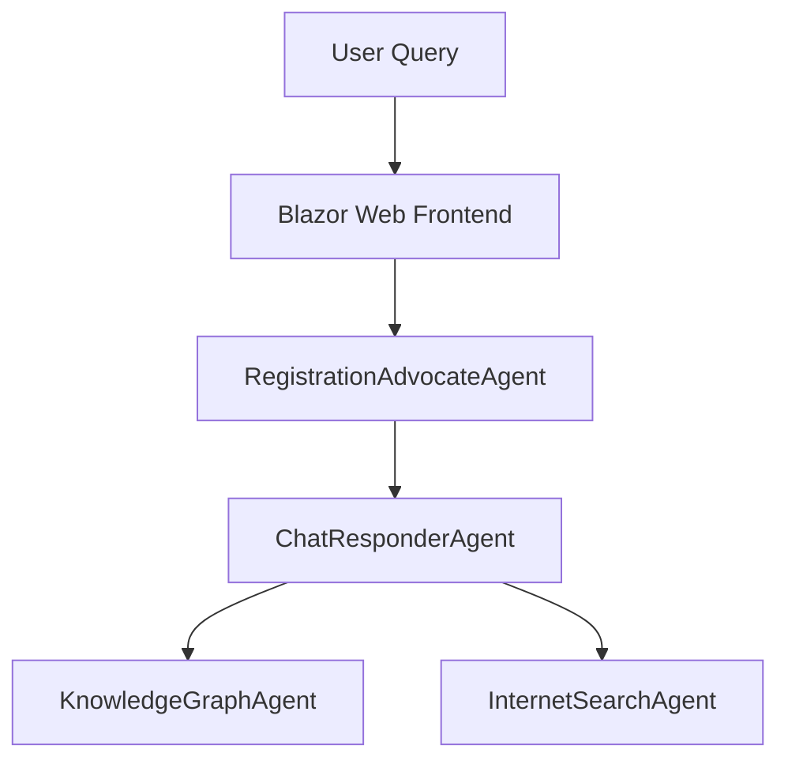

# Agent2Agent.AgentA - RegistrationAdvocateAgent

Agent2Agent.AgentA implements the **RegistrationAdvocateAgent**, a key component of the Agent2Agent proof-of-concept system. This agent is responsible for handling user interactions related to vehicle registration advocacy and serves as the entry point for inter-agent communication.

## Purpose

The RegistrationAdvocateAgent (AgentA) is designed to:

- **Facilitate user interactions**: Acts as the primary interface for users to interact with the system.
- **Coordinate inter-agent communication**: Delegates tasks to other agents, such as ChatResponderAgent and InternetSearchAgent.
- **Provide intelligent responses**: Uses AI-powered chat completion to assist users with vehicle registration-related queries.

## Architecture Role

Within the Agent2Agent ecosystem, AgentA serves as the user-facing entry point:



## Core Features

### AI-Powered Chat Completion
- **Semantic Kernel Integration**: Leverages Microsoft Semantic Kernel for orchestrating AI responses.
- **OpenAI Chat Models**: Uses OpenAI's GPT models for generating natural language responses.
- **Plugin Support**: Integrates plugins for inter-agent communication and task delegation.

### Inter-Agent Communication
- **A2A Protocol**: Implements the Agent-to-Agent (A2A) protocol for seamless communication with other agents.
- **Task Delegation**: Routes user queries to appropriate agents for specialized processing.
- **Response Aggregation**: Combines responses from multiple agents into a coherent reply.

### OpenAPI Integration
- **API Documentation**: Exposes OpenAPI endpoints for easy integration and testing.
- **Standardized Endpoints**: Provides consistent API interfaces for inter-agent and external communication.

## Technical Implementation

### Project Structure

```
Agent2Agent.AgentA/
??? Program.cs                          # Application entry point and configuration
??? Extensions/
?   ??? Dependencies.cs                 # Dependency injection configuration
??? Services/
?   ??? ChatCompletionAgent.cs          # Core chat logic implementation
?   ??? PluginManager.cs                # Manages inter-agent plugins
??? Providers/
?   ??? IAgentLogicInvoker.cs           # Interface for agent logic
?   ??? OpenAIProvider.cs               # OpenAI API integration
??? GlobalUsing.cs                      # Global namespace imports
```

### Key Components

#### **ChatCompletionAgent**
The main orchestrator for handling user queries:

- Processes incoming chat messages.
- Delegates tasks to other agents using plugins.
- Generates AI-powered responses using OpenAI models.

#### **PluginManager**
Manages inter-agent plugins:

- Registers plugins for ChatResponderAgent and InternetSearchAgent.
- Handles plugin lifecycle and error management.

#### **OpenAIProvider**
Integrates with OpenAI's API:

- Generates chat completions and embeddings.
- Configurable via `appsettings.json`.

## Configuration

### Required Settings

Create an `appsettings.json` file with the following configuration:

```json
{
  "Logging": {
    "LogLevel": {
      "Default": "Information",
      "Microsoft.AspNetCore": "Warning"
    }
  },
  "OpenAI": {
    "ModelId": "gpt-4o-mini",
    "ApiKey": "<your-openai-api-key>"
  },
  "AgentCard": {
    "Name": "RegistrationAdvocateAgent",
    "Description": "Handles user interactions and coordinates inter-agent communication for vehicle registration advocacy",
    "Version": "1.0.0"
  }
}
```

## API Endpoints

### OpenAPI Endpoints

- **GET** `/openapi.json` - OpenAPI specification.
- **POST** `/api/agent/chat` - Handles user chat messages.
- **GET** `/health` - Application health check.
- **GET** `/alive` - Liveness probe.

## Development

### Building and Running

```bash
# Prerequisites
dotnet --version  # Ensure .NET 9 SDK

# Build the project
dotnet build

# Run with development settings
dotnet run --environment Development

# Run with custom configuration
dotnet run --urls="http://localhost:5000;https://localhost:7000"
```

### Testing the Agent

```bash
# Check agent availability
curl http://localhost:5000/health

# Test chat endpoint
curl -X POST http://localhost:5000/api/agent/chat \
  -H "Content-Type: application/json" \
  -d '{"message": "How do I register my vehicle?"}'
```

## Troubleshooting

### Common Issues

**OpenAI API Errors**
```
Symptoms: Responses fail with API error messages.
Causes: Invalid API key, network issues, or model configuration.
Solution: Verify API key and network connectivity. Check `appsettings.json` for correct model ID.
```

**Inter-Agent Communication Failures**
```
Symptoms: Tasks are not delegated to other agents.
Causes: Plugin registration issues or network connectivity problems.
Solution: Ensure plugins are correctly registered and other agents are running.
```

## Related Documentation

- [Agent2Agent Architecture](../Docs/architecture.md)
- [A2A Protocol Specification](https://a2aproject.github.io/A2A/v0.2.5/)
- [Microsoft Semantic Kernel](https://learn.microsoft.com/en-us/semantic-kernel/)

---

**Note**: This agent is specifically designed for the Agent2Agent proof-of-concept and implements the A2A protocol for inter-agent communication. For production use, consider implementing additional security, monitoring, and scalability features.