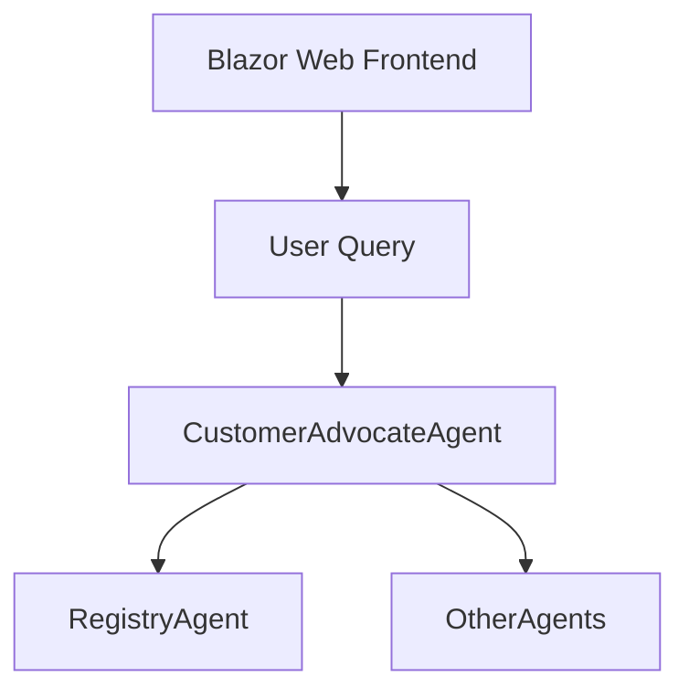
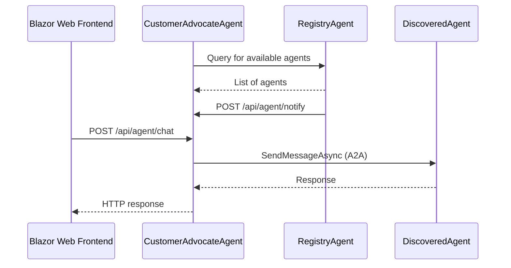

# Agent2Agent.AgentA - Customer Advocate Agent

Agent2Agent.AgentA implements the **Customer Advocate Agent**, the entry point for customer inquiries and automotive assistance in the Agent2Agent system. It orchestrates AI-powered chat, manages conversation history, and delegates tasks to other agents using the A2A protocol.

## Overview

- **Purpose:** Handle customer inquiries, provide automotive information, and coordinate with other agents.
- **Role:** Receives chat input, invokes AI (OpenAI via Semantic Kernel), manages chat history (Redis), and delegates tasks to other agents through plugins.

## Architecture

- ASP.NET Core Web API.
- Microsoft Semantic Kernel for AI orchestration.
- Distributed caching (Redis) for chat history.
- Extensible via plugins (e.g., CustomerAdvocatePlugin).
- Inter-agent communication via A2A protocol.


## Sequence Diagram


> **Note:** The RegistryAgent is only used for agent discovery and registration. During query processing, the CustomerAdvocatePlugin interacts directly with discovered agents (not the RegistryAgent) to process and aggregate responses.


## Core Components

- **AgentController:** Exposes API endpoints for chat (`/api/agent/chat`) and agent registry notifications (`/api/agent/notify`).
- **ConversationService:** Manages chat history, invokes AI, persists threads in Redis.
- **AgentCacheProvider:** In-memory cache of known agents, supports add/remove.
- **CustomerAdvocatePlugin:** Sends inquiries to other agents via A2A, handles responses.
- **Dependencies:** Registers all services, configures AI agent, plugins, and DI.

## Configuration

- **OpenAI:** API key and model for chat completion.
- **Redis:** Connection string for distributed cache.
- **Agent Metadata:** Name, description, URL, version, provider, capabilities, extensions, skills.
- **Registry Agent URL:** For inter-agent communication.

Example `appsettings.json`:
```json
{
  "OpenAI": { 
    "ApiKey": "<your-openai-api-key>", 
    "ModelId": "<your-model-id>" 
  },
  "Agents": { 
    "RegistryAgentUrl": "http://localhost:5129/a2a" 
  },
  "Redis": { 
    "ConnectionString": "127.0.0.1:6379" 
  },
  "AgentCard": {
    "Name": "Customer Advocate Agent",
    "Description": "AgentA is responsible for handling customer inquiries and providing assistance",
    "Url": "http://localhost:5144/a2a",
    "Version": "1.0.0",
    "Provider": { "Organization": "Made by Nerddy" },
    "Capabilities": {
      "Streaming": false,
      "PushNotifications": true,
      "Extensions": [
        { "Uri": "http://localhost:5144/api/agent/notify", "Description": "Notification" }
      ]
    },
    "Authentication": null,
    "DefaultInputModes": [ "text" ],
    "DefaultOutputModes": [ "text" ],
    "Skills": []
  }
}
```

## Extensibility

- **Plugins:** Add new agent skills or integrations by implementing plugins (see `CustomerAdvocatePlugin`).
- **Dynamic Registration:** Skills and endpoints are dynamically registered at startup.

## API Endpoints

- **POST** `/api/agent/chat` — Handles user chat messages.
- **POST** `/api/agent/notify` — Receives agent registry notifications.
- **GET** `/health` — Application health check (if enabled in host).
- **GET** `/alive` — Liveness probe (if enabled in host).
- **GET** `/openapi.json` — OpenAPI specification (if enabled in host).

## Development

- **Build:** `dotnet build`
- **Run (development):** `dotnet run --environment Development`
- **Run (custom):** `dotnet run --urls="http://localhost:5000;https://localhost:7000"`

### Testing

```bash
curl http://localhost:5000/health
curl -X POST http://localhost:5000/api/agent/chat \
  -H "Content-Type: application/json" \
  -d '{"sessionId": "user1", "content": "How do I register my vehicle?"}'
```

## Troubleshooting

- **OpenAI API Errors:** Check API key, model, and network connectivity.
- **Redis Issues:** Ensure Redis is running and connection string is correct.
- **Inter-Agent Communication:** Verify plugins are registered and other agents are reachable.

## Related Documentation

- [Agent2Agent Architecture](../Docs/architecture.md)
- [A2A Protocol Specification](https://a2aproject.github.io/A2A/v0.2.5/)
- [Microsoft Semantic Kernel](https://learn.microsoft.com/en-us/semantic-kernel/)

---

**Note:** This agent is designed for the Agent2Agent proof-of-concept and implements the A2A protocol for inter-agent communication. For production, implement additional security, monitoring, and scalability features.