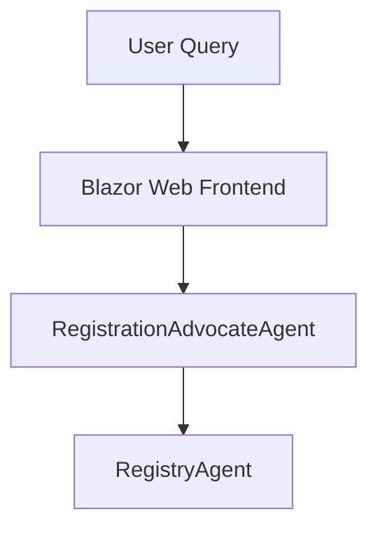

# Agent2Agent.AgentB - Agent Registry

Agent2Agent.AgentB implements the **RegistryAgent**, a key component of the Agent2Agent proof-of-concept system. This agent is responsible for handling agent registration and discovery, facilitating inter-agent communication through the Agent-to-Agent (A2A) protocol.

## Purpose

The RegistryAgent (AgentB) is designed to:

- **Agent Registration and Discovery**: Handle registration of agents and facilitate discovery through the Agent-to-Agent (A2A) protocol.


## Architecture Role

Within the Agent2Agent ecosystem, AgentB serves as the conversational logic processor:



## Core Features

### Conversational Logic
- **Semantic Kernel Integration**: Leverages Microsoft Semantic Kernel for orchestrating conversational responses.
- **Task Delegation**: Routes specific queries to the KnowledgeGraphAgent and InternetSearchAgent.
- **Response Aggregation**: Combines and refines responses from multiple agents into a single coherent reply.

### Inter-Agent Communication
- **A2A Protocol**: Implements the Agent-to-Agent (A2A) protocol for seamless communication with other agents.
- **Asynchronous Processing**: Handles multiple concurrent tasks efficiently.
- **Error Handling**: Provides robust error management and fallback mechanisms.

### OpenAPI Integration
- **API Documentation**: Exposes OpenAPI endpoints for easy integration and testing.
- **Standardized Endpoints**: Provides consistent API interfaces for inter-agent and external communication.

## Technical Implementation

### Project Structure

```
Agent2Agent.AgentB/
├── Program.cs                          # Application entry point and configuration
├── Extensions/
│   └── Dependencies.cs                 # Dependency injection configuration
├── Agents/
│   ├── KnowledgeBaseAgent.cs           # Handles queries to the KnowledgeGraphAgent
│   ├── InternetSearchAgent.cs          # Handles queries to the InternetSearchAgent
│   ├── IAgent.cs                       # Interface for agent logic
│   └── Agent2AgentManager.cs           # Manages inter-agent communication
├── Services/
│   └── ChatResponderAgentLogic.cs      # Core conversational logic implementation
└── GlobalUsing.cs                      # Global namespace imports
```

### Key Components

#### **ChatResponderAgentLogic**
The main orchestrator for handling conversational queries:

- Processes incoming A2A messages.
- Delegates tasks to the KnowledgeBaseAgent and InternetSearchAgent.
- Aggregates and refines responses for the RegistrationAdvocateAgent.

#### **Agent2AgentManager**
Manages inter-agent communication:

- Implements the A2A protocol for task delegation.
- Handles task lifecycle and error management.

#### **KnowledgeBaseAgent**
Handles queries to the KnowledgeGraphAgent:

- Sends knowledge queries and retrieves relevant information.
- Processes responses for integration into conversational replies.

#### **InternetSearchAgent**
Handles queries to the InternetSearchAgent:

- Sends search queries and retrieves results.
- Processes responses for integration into conversational replies.

## Configuration

### Required Settings

Create an `appsettings.json` file with the following configuration:

```json
{
  "Logging": {
    "LogLevel": {
      "Default": "Information",
      "Microsoft.AspNetCore": "Warning"
    }
  },
  "AgentCard": {
    "Name": "ChatResponderAgent",
    "Description": "Handles conversational logic and coordinates inter-agent communication",
    "Version": "1.0.0"
  }
}
```

## API Endpoints

### A2A Protocol Endpoints

- **GET** `/.well-known/agent.json` - Agent capability discovery.
- **POST** `/tasks` - Create new conversational task.
- **GET** `/tasks/{taskId}` - Retrieve task status and results.
- **POST** `/tasks/{taskId}/cancel` - Cancel running task.

### Health and Monitoring

- **GET** `/health` - Application health check.
- **GET** `/alive` - Liveness probe.

## Development

### Building and Running

```bash
# Prerequisites
dotnet --version  # Ensure .NET 9 SDK

# Build the project
dotnet build

# Run with development settings
dotnet run --environment Development

# Run with custom configuration
dotnet run --urls="http://localhost:5001;https://localhost:7001"
```

### Testing the Agent

```bash
# Check agent availability
curl http://localhost:5001/health

# Test conversational task endpoint
curl -X POST http://localhost:5001/tasks \
  -H "Content-Type: application/json" \
  -d '{"message": "Tell me about vehicle registration."}'
```

## Troubleshooting

### Common Issues

**Inter-Agent Communication Failures**
```
Symptoms: Tasks are not delegated to other agents.
Causes: Network connectivity issues or agent unavailability.
Solution: Ensure all agents are running and reachable.
```

**High Response Latency**
```
Symptoms: Slow responses to user queries.
Causes: Delays in inter-agent communication or processing.
Solution: Optimize agent configurations and monitor network performance.
```

## Related Documentation

- [Agent2Agent Architecture](../Docs/architecture.md)
- [A2A Protocol Specification](https://a2aproject.github.io/A2A/v0.2.5/)
- [Microsoft Semantic Kernel](https://learn.microsoft.com/en-us/semantic-kernel/)

---

**Note**: This agent is specifically designed for the Agent2Agent proof-of-concept and implements the A2A protocol for inter-agent communication. For production use, consider implementing additional security, monitoring, and scalability features.