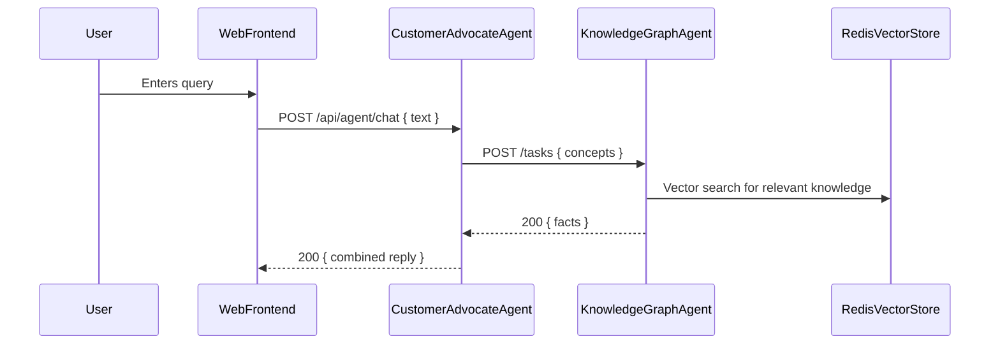

# Agent2Agent.AgentC - KnowledgeGraphAgent


A .NET 9 ASP.NET Core web service implementing the **KnowledgeGraphAgent** in the Agent2Agent proof-of-concept system. This agent serves as an intelligent knowledge base that provides contextual information about vehicle registration topics using vector similarity search and AI-powered responses.

## Purpose

The KnowledgeGraphAgent (AgentC) is a specialized AI agent that:

- **Manages a vector-based knowledge store** using Redis Stack for efficient semantic search
- **Processes knowledge queries** from other agents using the A2A (Agent-to-Agent) protocol
- **Generates contextual responses** by combining retrieved knowledge with OpenAI's language models
- **Provides factual grounding** for conversational AI interactions about vehicle registration

## Architecture

Within the Agent2Agent ecosystem, AgentC serves as the knowledge foundation for semantic search and factual grounding.

### Sequence Diagram



## Core Features

### Vector Knowledge Store
- **Redis Stack Integration**: Utilizes Redis's vector search capabilities for high-performance similarity matching
- **OpenAI Embeddings**: Converts text queries into high-dimensional vectors for semantic search
- **Metadata Preservation**: Maintains document structure, source attribution, and content classification
- **Scalable Storage**: Efficiently handles large knowledge bases with optimized indexing

### AI-Powered Processing
- **Semantic Kernel Integration**: Leverages Microsoft Semantic Kernel for agent orchestration
- **OpenAI Chat Completion**: Generates natural language responses based on retrieved knowledge
- **Context Synthesis**: Combines multiple knowledge chunks into coherent, relevant answers
- **Query Understanding**: Processes natural language queries with intelligent intent recognition

### A2A Protocol Implementation
- **Agent-to-Agent Communication**: Implements the A2A standard for inter-agent messaging
- **Task Management**: Handles asynchronous task processing with status tracking
- **Streaming Support**: Capable of real-time response streaming for interactive experiences
- **Error Handling**: Robust error management with detailed logging and graceful degradation

## Technical Implementation

### Project Structure

```
Agent2Agent.AgentC/
├── Program.cs                          # Application entry point and configuration
├── Extensions/
│   └── Dependencies.cs                 # Dependency injection configuration
├── Services/
│   ├── KnowledgeGraphAgentLogic.cs    # Core agent logic implementation
│   └── FactStoreService.cs            # Knowledge base search service
├── Providers/
│   ├── IEmbeddingProvider.cs          # OpenAI embedding generation
│   └── IVectorStoreProvider.cs        # Redis vector storage operations
└── GlobalUsing.cs                     # Global namespace imports
```

### Key Components

#### **KnowledgeGraphAgentLogic**
The main orchestrator that implements `IAgentLogicInvoker`:

- Extracts text from incoming A2A messages
- Delegates knowledge search to `FactStoreService`
- Uses Semantic Kernel's `ChatCompletionAgent` for response generation
- Manages task state transitions (Working → Completed)
- Handles errors gracefully with appropriate logging

#### **FactStoreService**
Manages knowledge base interactions:

- Integrates embedding generation with vector search
- Configurable similarity threshold (0.78) for relevance filtering
- Top-K retrieval (25) for comprehensive context
- Error handling for empty queries and search failures

#### **RedisVectorStoreProvider**
Handles Redis Stack operations with these technical specifications:

- **Vector Dimensions**: 1536 (OpenAI text-embedding-3-small)
- **Distance Metric**: Cosine similarity
- **Index Algorithm**: FLAT for optimal recall
- **Serialization**: IEEE 754 little-endian float arrays
- **Automatic Index Creation**: Ensures schema exists on startup

#### **OpenAIEmbeddingProvider**
Generates vector embeddings:

- Default model: `text-embedding-3-small`
- Configurable via `OpenAI:EmbeddingModel` setting
- Robust error handling for API failures
- Efficient conversion from OpenAI response format

### Dependencies and Packages

- **Microsoft.SemanticKernel.Agents.Core** (1.59.0): Agent framework and orchestration
- **Microsoft.SemanticKernel.Connectors.OpenAI** (1.59.0): OpenAI integration for chat and embeddings
- **NRedisStack** (1.0.0): Redis Stack client for vector operations
- **OpenAI** (2.2.0): Direct OpenAI API client
- **A2Adotnet.Server**: A2A protocol implementation

## Configurations

### appsettings.json Example

```json
{
  "Logging": {
    "LogLevel": {
      "Default": "Information",
      "Microsoft.AspNetCore": "Warning"
    }
  },
  "AllowedHosts": "*",
  "OpenAI": {
    "ApiKey": "Agent2Agent AgentA API",
    "ModelId": "o4-mini",
    "EmbeddingModel": "text-embedding-ada-002"
  },
  "Redis": {
    "ConnectionString": "127.0.0.1:6379"
  },
  "Agents": {
    "RegistryAgentUrl": "http://localhost:5129/a2a"
  },
  "AgentCard": {
    "Name": "Vehicle Registration Agent",
    "Description": "This agent can assist with vehicle registration tasks.",
    "Url": "http://localhost:5012/a2a",
    "Version": "1.0.0",
    "Provider": {
      "Organization": "Made by Nerddy"
    },
    "Capabilities": {
      "Streaming": false,
      "PushNotifications": false
    },
    "Authentication": null,
    "DefaultInputModes": [ "text" ],
    "DefaultOutputModes": [ "text" ],
    "Skills": [
      {
        "Id": "knowledgebase",
        "Name": "get_vehicle_information_from_knowledge_base",
        "Description": "Retrieves vehicle information from a vehicle knowledge base. The knowledge base contains detailed information about various vehicle models, specifications, and regulations.",
        "Examples": [
          "What is a vehicle registration?",
          "How is a vehicle registration structured?",
          "What is the purpose of a vehicle registration?",
          "What information is typically included in a vehicle registration?"
        ]
      }
    ]
  }
}
```

## Redis Schema

### Vector Index Configuration

The agent automatically creates a Redis vector index with the following schema:

```
Index Name: vehicle_docs_idx
Fields:
  - embedding: Vector field (FLOAT32, 1536 dimensions, COSINE distance)
  - title: Text field (weight: 2)
  - content: Text field
  - state: Text field
  - sourceUrl: Text field
  - documentType: Text field
```

### Document Storage Format

Documents are stored as Redis hashes:

```
Key: doc:{unique-id}
Hash Fields:
  - text: The actual text content
  - embedding: Serialized float array (IEEE 754 little-endian)
  - state: US state abbreviation
  - sourceUrl: Original document source
  - documentType: Classification (Form, Guide, Fee Schedule, etc.)
  - title: Document title
```

## API Endpoints

### OpenAPI & A2A Endpoints

- **GET** `/.well-known/agent.json` - Agent capability discovery
- **POST** `/tasks` - Create new knowledge query task
- **GET** `/tasks/{taskId}` - Retrieve task status and results
- **POST** `/tasks/{taskId}/cancel` - Cancel running task

### Health and Monitoring

- **GET** `/health` - Application health check
- **GET** `/alive` - Liveness probe

## Development

### Building and Running

> **Note:**
> Redis must be configured and running on your system before starting the agent.
> If you prefer to use Docker containers, you can start Redis and other dependencies using the provided `docker_compose.yml` in the root directory:
> ```bash
> docker compose -f docker_compose.yml up -d
> ```

```bash
# Prerequisites
dotnet --version  # Ensure .NET 9 SDK

# Build the project
dotnet build

# Run with development settings
dotnet run --environment Development

# Run with custom configuration
dotnet run --urls="http://localhost:5012;https://localhost:7288"
```

### Testing the Agent

**Sample Query**

```bash
curl -X POST http://localhost:5012/tasks \
  -H "Content-Type: application/json" \
  -d '{
    "message": {
      "role": "user",
      "parts": [
        { "type": "text", "text": "What is a vehicle registration?" }
      ]
    }
  }'
```

**Sample Response**
```json
{
  "status": "Completed",
  "result": {
    "answer": "A vehicle registration is an official record of a vehicle with a government authority, typically including details such as the owner's name, address, vehicle identification number (VIN), and license plate number. It is required to legally operate a vehicle on public roads."
  }
}
```

### Integration Points

#### With DatasetCreator
- **Data Ingestion**: Receives pre-processed knowledge chunks with embeddings
- **Schema Compatibility**: Uses identical Redis schema for seamless integration
- **Metadata Alignment**: Preserves document structure and source attribution


#### With RegistryAgent (AgentB)
- **Service Registration**: AgentC interacts with AgentB only to register itself for agent discovery.
- **Discovery**: This allows CustomerAdvocateAgent (AgentA) and other agents to discover and communicate with AgentC via the A2A protocol.
- **No Query Routing**: AgentB does not forward or process knowledge queries for AgentC.

#### With CustomerAdvocateAgent (AgentA)
- **Direct Consumer**: AgentA (CustomerAdvocateAgent) is the primary consumer of AgentC's knowledge services.
- **Flow**: AgentA discovers AgentC via AgentB and sends knowledge queries directly to AgentC using the A2A protocol.
- **Purpose**: AgentC provides factual context and knowledge grounding for user queries handled by AgentA.

## Related Documentation

- [Agent2Agent Architecture](../Docs/architecture.md)
- [A2A Protocol Specification](https://a2aproject.github.io/A2A/v0.2.5/)
- [DatasetCreator Integration](../DatasetCreator/README.md)
- [Microsoft Semantic Kernel](https://learn.microsoft.com/en-us/semantic-kernel/)
- Redis Stack Documentation
  - [Connect to the Server](https://redis.io/docs/latest/develop/clients/dotnet/connect/)
  - [Index and query Vectors](https://redis.io/docs/latest/develop/clients/dotnet/vecsearch/)
  - [Vector search concepts](https://redis.io/docs/latest/develop/ai/search-and-query/vectors/)

---

**Note**: This agent is specifically designed for the Agent2Agent proof-of-concept and implements the A2A protocol for inter-agent communication. For production use, consider implementing additional security, monitoring, and scalability features.
