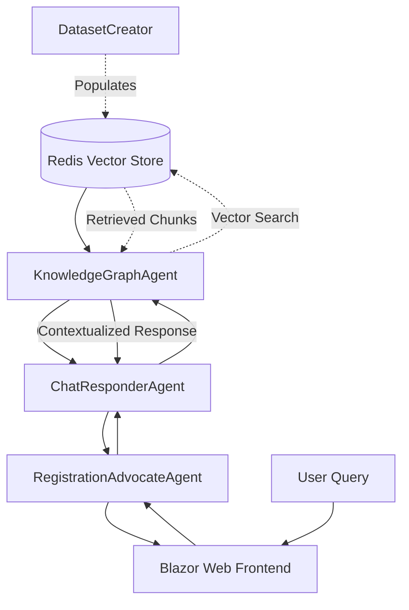

# Agent2Agent.AgentC - KnowledgeGraphAgent

A .NET 9 ASP.NET Core web service implementing the **KnowledgeGraphAgent** in the Agent2Agent proof-of-concept system. This agent serves as an intelligent knowledge base that provides contextual information about vehicle registration topics using vector similarity search and AI-powered responses.

## Purpose

The KnowledgeGraphAgent (AgentC) is a specialized AI agent that:

- **Manages a vector-based knowledge store** using Redis Stack for efficient semantic search
- **Processes knowledge queries** from other agents using the A2A (Agent-to-Agent) protocol
- **Generates contextual responses** by combining retrieved knowledge with OpenAI's language models
- **Provides factual grounding** for conversational AI interactions about vehicle registration

## Architecture Role

Within the Agent2Agent ecosystem, AgentC serves as the knowledge foundation:



## Core Features

### Vector Knowledge Store
- **Redis Stack Integration**: Utilizes Redis's vector search capabilities for high-performance similarity matching
- **OpenAI Embeddings**: Converts text queries into high-dimensional vectors for semantic search
- **Metadata Preservation**: Maintains document structure, source attribution, and content classification
- **Scalable Storage**: Efficiently handles large knowledge bases with optimized indexing

### AI-Powered Processing
- **Semantic Kernel Integration**: Leverages Microsoft Semantic Kernel for agent orchestration
- **OpenAI Chat Completion**: Generates natural language responses based on retrieved knowledge
- **Context Synthesis**: Combines multiple knowledge chunks into coherent, relevant answers
- **Query Understanding**: Processes natural language queries with intelligent intent recognition

### A2A Protocol Implementation
- **Agent-to-Agent Communication**: Implements the A2A standard for inter-agent messaging
- **Task Management**: Handles asynchronous task processing with status tracking
- **Streaming Support**: Capable of real-time response streaming for interactive experiences
- **Error Handling**: Robust error management with detailed logging and graceful degradation

## Technical Implementation

### Project Structure

```
Agent2Agent.AgentC/
├── Program.cs                          # Application entry point and configuration
├── Extensions/
│   └── Dependencies.cs                 # Dependency injection configuration
├── Services/
│   ├── KnowledgeGraphAgentLogic.cs    # Core agent logic implementation
│   └── FactStoreService.cs            # Knowledge base search service
├── Providers/
│   ├── IEmbeddingProvider.cs          # OpenAI embedding generation
│   └── IVectorStoreProvider.cs        # Redis vector storage operations
└── GlobalUsing.cs                     # Global namespace imports
```

### Key Components

#### **KnowledgeGraphAgentLogic**
The main orchestrator that implements `IAgentLogicInvoker`:

**Implementation Details:**
- Extracts text from incoming A2A messages
- Delegates knowledge search to `FactStoreService`
- Uses Semantic Kernel's `ChatCompletionAgent` for response generation
- Manages task state transitions (Working → Completed)
- Handles errors gracefully with appropriate logging

#### **FactStoreService**
Manages knowledge base interactions:

**Key Features:**
- Integrates embedding generation with vector search
- Configurable similarity threshold (0.78) for relevance filtering
- Top-K retrieval (25) for comprehensive context
- Error handling for empty queries and search failures

#### **RedisVectorStoreProvider**
Handles Redis Stack operations with these technical specifications:
- **Vector Dimensions**: 1536 (OpenAI text-embedding-3-small)
- **Distance Metric**: Cosine similarity
- **Index Algorithm**: FLAT for optimal recall
- **Serialization**: IEEE 754 little-endian float arrays
- **Automatic Index Creation**: Ensures schema exists on startup

#### **OpenAIEmbeddingProvider**
Generates vector embeddings:
- Default model: `text-embedding-3-small`
- Configurable via `OpenAI:EmbeddingModel` setting
- Robust error handling for API failures
- Efficient conversion from OpenAI response format

### Dependencies and Packages

- **Microsoft.SemanticKernel.Agents.Core** (1.59.0): Agent framework and orchestration
- **Microsoft.SemanticKernel.Connectors.OpenAI** (1.59.0): OpenAI integration for chat and embeddings
- **NRedisStack** (1.0.0): Redis Stack client for vector operations
- **OpenAI** (2.2.0): Direct OpenAI API client
- **A2Adotnet.Server**: A2A protocol implementation

## Configuration

### Required Settings

Create an `appsettings.json` file with the following configuration:

```json
{
  "Logging": {
    "LogLevel": {
      "Default": "Information",
      "Microsoft.AspNetCore": "Warning"
    }
  },
  "Redis": {
    "ConnectionString": "localhost:6379"
  },
  "OpenAI": {
    "ModelId": "gpt-4o-mini",
    "ApiKey": "<your-openai-api-key>",
    "EmbeddingModel": "text-embedding-3-small"
  },
  "AgentCard": {
    "Name": "KnowledgeGraphAgent",
    "Description": "Provides knowledge base search and contextual responses for vehicle registration information",
    "Version": "1.0.0"
  }
}
```

## Redis Schema

### Vector Index Configuration

The agent automatically creates a Redis vector index with the following schema:

```
Index Name: vehicle_docs_idx
Fields:
  - embedding: Vector field (FLOAT32, 1536 dimensions, COSINE distance)
  - title: Text field (weight: 2)
  - content: Text field
  - state: Text field
  - sourceUrl: Text field
  - documentType: Text field
```

### Document Storage Format

Documents are stored as Redis hashes:

```
Key: doc:{unique-id}
Hash Fields:
  - text: The actual text content
  - embedding: Serialized float array (IEEE 754 little-endian)
  - state: US state abbreviation
  - sourceUrl: Original document source
  - documentType: Classification (Form, Guide, Fee Schedule, etc.)
  - title: Document title
```

## API Endpoints

### A2A Protocol Endpoints

The agent exposes standard A2A endpoints:

- **GET** `/.well-known/agent.json` - Agent capability discovery
- **POST** `/tasks` - Create new knowledge query task
- **GET** `/tasks/{taskId}` - Retrieve task status and results
- **POST** `/tasks/{taskId}/cancel` - Cancel running task

### Health and Monitoring

- **GET** `/health` - Application health check
- **GET** `/alive` - Liveness probe

## Performance Characteristics

### Vector Search Performance
- **Query Latency**: Typically 10-50ms for similarity search
- **Throughput**: Can handle 100+ concurrent queries
- **Accuracy**: Cosine similarity threshold of 0.78 for relevance filtering
- **Index Size**: Supports millions of document chunks

### Memory Usage
- **Base Memory**: ~100-200MB for application
- **Redis Memory**: Scales with document count (~4KB per chunk)
- **Embedding Cache**: Temporary storage for query embeddings

## Development

### Building and Running

```bash
# Prerequisites
dotnet --version  # Ensure .NET 9 SDK
redis-server --version  # Ensure Redis Stack

# Build the project
dotnet build

# Run with development settings
dotnet run --environment Development

# Run with custom configuration
dotnet run --urls="http://localhost:5012;https://localhost:7288"
```

### Testing the Agent

```bash
# Check agent availability
curl http://localhost:5012/.well-known/agent.json

# Test knowledge query
curl -X POST http://localhost:5012/tasks \
  -H "Content-Type: application/json" \
  -d '{
    "id": "test-query",
    "message": {
      "role": "user", 
      "parts": [{"type": "text", "text": "vehicle registration process"}]
    }
  }'
```

## Integration Points

### With DatasetCreator
- **Data Ingestion**: Receives pre-processed knowledge chunks with embeddings
- **Schema Compatibility**: Uses identical Redis schema for seamless integration
- **Metadata Alignment**: Preserves document structure and source attribution

### With ChatResponderAgent (AgentB)
- **Query Processing**: Receives natural language queries about vehicle registration
- **Context Provision**: Returns relevant knowledge chunks for response generation
- **Fallback Handling**: Indicates when no relevant information is found

### With RegistrationAdvocateAgent (AgentA)
- **Indirect Integration**: Accessed via AgentB for knowledge enrichment
- **Response Enhancement**: Provides factual grounding for user interactions

## Troubleshooting

### Common Issues

**Vector Search Returns No Results**
```
Symptoms: All queries return "No relevant information found"
Causes: Empty Redis index, incorrect embedding model, threshold too high
Solution: Verify data ingestion, check embedding compatibility, adjust similarity threshold
```

**High Response Latency**
```
Symptoms: Slow query responses (>500ms)
Causes: Redis performance, large result sets, OpenAI API delays
Solution: Optimize Redis configuration, tune topK parameter, monitor API performance
```

**Memory Growth**
```
Symptoms: Increasing memory usage over time
Causes: Embedding caching, connection leaks, large response buffers
Solution: Review caching strategy, check connection disposal, monitor GC performance
```

## Related Documentation

- [Agent2Agent Architecture](../Docs/architecture.md)
- [A2A Protocol Specification](https://a2aproject.github.io/A2A/v0.2.5/)
- [DatasetCreator Integration](../DatasetCreator/README.md)
- [Microsoft Semantic Kernel](https://learn.microsoft.com/en-us/semantic-kernel/)
- Redis Stack Documentation
  - [Connect to the Server](https://redis.io/docs/latest/develop/clients/dotnet/connect/)
  - [Index and query Vectors](https://redis.io/docs/latest/develop/clients/dotnet/vecsearch/)
  - [Vector search concepts](https://redis.io/docs/latest/develop/ai/search-and-query/vectors/)
---

**Note**: This agent is specifically designed for the Agent2Agent proof-of-concept and implements the A2A protocol for inter-agent communication. For production use, consider implementing additional security, monitoring, and scalability features.