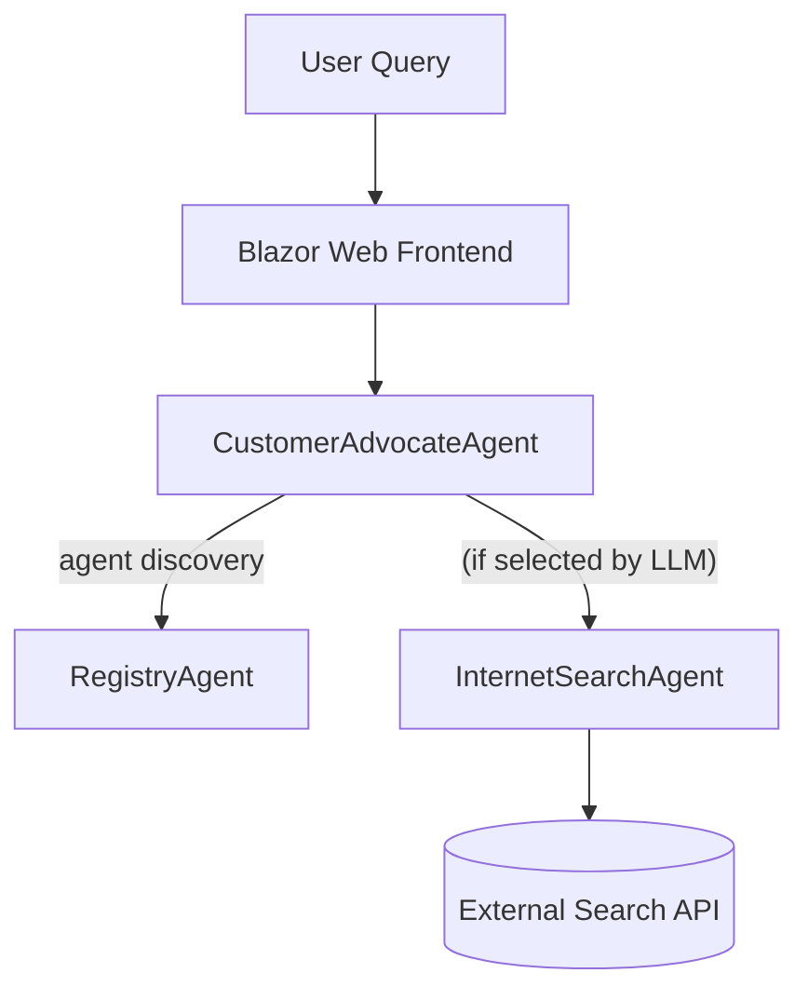
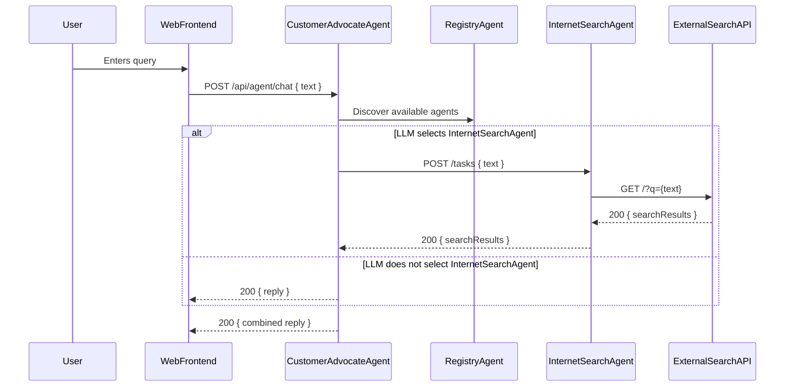

# Agent2Agent.AgentD - InternetSearchAgent

Agent2Agent.AgentD implements the **InternetSearchAgent**, a key component of the Agent2Agent proof-of-concept system. This agent is responsible for handling internet search queries and providing relevant information to other agents in the system. It acts as a fallback and enrichment provider when internal knowledge is insufficient.

## Purpose

The InternetSearchAgent (AgentD) is designed to:

- **Process internet search queries**: Handles user or agent-initiated queries requiring external information.
- **Integrate with Semantic Kernel**: Uses AI-powered tools to generate intelligent responses.
- **Support inter-agent communication**: Provides search results to other agents, such as the RegistryAgent.

---

## Architecture & Sequence

### System Architecture



### Sequence Diagram



---

## Core Features

### Internet Search Logic

- **Semantic Kernel Integration**: Leverages Microsoft Semantic Kernel for orchestrating search responses.
- **AI-Powered Search**: Uses OpenAI models to process and refine search results.
- **Error Handling**: Provides robust error management and fallback mechanisms.

### External API Integration

- Connects to external search APIs for live data.
- Handles API errors gracefully and provides fallback messaging.
- Easily extensible to support additional providers.

### Inter-Agent Communication

- **A2A Protocol**: Implements the Agent-to-Agent (A2A) protocol for seamless communication with other agents.
- **Task Management**: Handles asynchronous task processing with status tracking.
- **Streaming Support**: Capable of real-time response streaming for interactive experiences.

### OpenAPI Integration

- **API Documentation**: Exposes OpenAPI endpoints for easy integration and testing.
- **Standardized Endpoints**: Provides consistent API interfaces for inter-agent and external communication.

---

## Technical Implementation

### Project Structure

```
Agent2Agent.AgentD/
├── Program.cs                          # Application entry point and configuration
├── Extensions/
│   └── Dependencies.cs                 # Dependency injection configuration
├── Services/
│   └── InternetSearchAgentLogic.cs     # Core internet search logic implementation
├── GlobalUsing.cs                      # Global namespace imports
```

### Key Components

#### **InternetSearchAgentLogic**
- Orchestrates handling of internet search queries.
- Processes incoming A2A messages and manages task lifecycle.
- Integrates with Microsoft Semantic Kernel's `ChatCompletionAgent` for AI-powered search responses.
- Handles error management and fallback logic.

---

## Configuration

### Required Settings

Example `appsettings.json`:

```json
{
  "Logging": {
    "LogLevel": {
      "Default": "Information",
      "Microsoft.AspNetCore": "Warning"
    }
  },
  "AllowedHosts": "*",
  "OpenAI": {
    "ApiKey": "Agent2Agent AgentD API",
    "ModelId": "o4-mini"
  },
  "Agents": {
    "RegistryAgentUrl": "http://localhost:5129/a2a"
  },
  "AgentCard": {
    "Name": "Internet Search Agent",
    "Description": "This agent can assist with internet search tasks.",
    "Url": "http://localhost:5228/a2a",
    "Version": "1.0.0",
    "Provider": {
      "Organization": "Made by Nerddy"
    },
    "Capabilities": {
      "Streaming": false,
      "PushNotifications": false
    },
    "Authentication": null,
    "DefaultInputModes": [ "text" ],
    "DefaultOutputModes": [ "text" ],
    "Skills": [
      {
        "Id": "internetsearch",
        "Name": "search_the_internet_for_vehicle_information",
        "Description": "Search the internet for vehicle information.",
        "Examples": [
          "What is the vehicle registration information for california?",
          "What is the process for renewing a vehicle registration in Texas?",
          "How do I register a vehicle in Florida?",
          "What are the requirements for vehicle registration in New York?",
          "How can I check the status of my vehicle registration in Illinois?"
        ]
      }
    ]
  }
}
```

---

## API Endpoints

### A2A Protocol Endpoints

All A2A protocol endpoints are served under the `/a2a` route:

- **GET** `/a2a/.well-known/agent.json`
  Agent capability discovery.
- **POST** `/a2a/tasks`
  Create a new internet search task.
- **GET** `/a2a/tasks/{taskId}`
  Retrieve task status and results.
- **POST** `/a2a/tasks/{taskId}/cancel`
  Cancel a running task.

### Health and Monitoring

- **GET** `/health` - Application health check.
- **GET** `/alive` - Liveness probe.

#### Example: Create Search Task

```bash
curl -X POST http://localhost:5003/tasks \
  -H "Content-Type: application/json" \
  -d '{"message": "Search for vehicle registration requirements."}'
```

---

## Extension & Customization

- To add a new search provider, implement a plugin and register it in the DI container.
- Secure API keys and sensitive configuration using environment variables or secrets management.
- For production, consider adding authentication, monitoring, and scaling strategies.

---

## Troubleshooting

### Search Query Errors

**Symptoms:** Responses fail with error messages.  
**Causes:** Invalid query format or external API issues.  
**Solution:** Verify query format and check external API availability.

### Inter-Agent Communication Failures

**Symptoms:** Tasks are not delegated to other agents.  
**Causes:** Network connectivity issues or agent unavailability.  
**Solution:** Ensure all agents are running and reachable.

### Logs & Diagnostics

- Use `/health` and `/alive` endpoints for status checks.
- Review application logs for error details.

---

## Development

### Building and Running

```bash
# Prerequisites
dotnet --version  # Ensure .NET 9 SDK

# Build the project
dotnet build

# Run with development settings
dotnet run --environment Development

# Run with custom configuration
dotnet run --urls="http://localhost:5003;https://localhost:7003"
```

### Testing the Agent

```bash
# Check agent availability
curl http://localhost:5003/health

# Test internet search task endpoint
curl -X POST http://localhost:5003/tasks \
  -H "Content-Type: application/json" \
  -d '{"message": "Search for vehicle registration requirements."}'
```

---

## Related Documentation

- [Agent2Agent Architecture](../Docs/architecture.md)
- [A2A Protocol Specification](https://a2aproject.github.io/A2A/v0.2.5/)
- [Microsoft Semantic Kernel](https://learn.microsoft.com/en-us/semantic-kernel/)

---

**Note**: This agent is specifically designed for the Agent2Agent proof-of-concept and implements the A2A protocol for inter-agent communication. For production use, consider implementing additional security, monitoring, and scalability features.