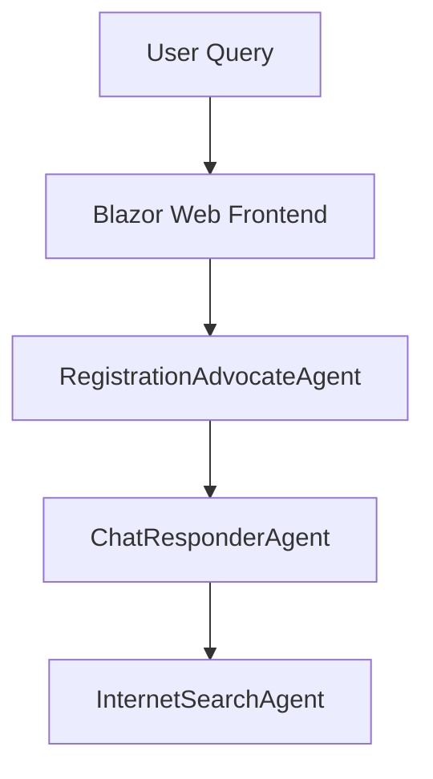

# Agent2Agent.AgentD - InternetSearchAgent

Agent2Agent.AgentD implements the **InternetSearchAgent**, a key component of the Agent2Agent proof-of-concept system. This agent is responsible for handling internet search queries and providing relevant information to other agents in the system.

## Purpose

The InternetSearchAgent (AgentD) is designed to:

- **Process internet search queries**: Handles user or agent-initiated queries requiring external information.
- **Integrate with Semantic Kernel**: Uses AI-powered tools to generate intelligent responses.
- **Support inter-agent communication**: Provides search results to other agents, such as the ChatResponderAgent.

## Architecture Role

Within the Agent2Agent ecosystem, AgentD serves as the external information provider:



## Core Features

### Internet Search Logic
- **Semantic Kernel Integration**: Leverages Microsoft Semantic Kernel for orchestrating search responses.
- **AI-Powered Search**: Uses OpenAI models to process and refine search results.
- **Error Handling**: Provides robust error management and fallback mechanisms.

### Inter-Agent Communication
- **A2A Protocol**: Implements the Agent-to-Agent (A2A) protocol for seamless communication with other agents.
- **Task Management**: Handles asynchronous task processing with status tracking.
- **Streaming Support**: Capable of real-time response streaming for interactive experiences.

### OpenAPI Integration
- **API Documentation**: Exposes OpenAPI endpoints for easy integration and testing.
- **Standardized Endpoints**: Provides consistent API interfaces for inter-agent and external communication.

## Technical Implementation

### Project Structure

```
Agent2Agent.AgentD/
??? Program.cs                          # Application entry point and configuration
??? Extensions/
?   ??? Dependencies.cs                 # Dependency injection configuration
??? Services/
?   ??? InternetSearchAgentLogic.cs     # Core internet search logic implementation
??? GlobalUsing.cs                      # Global namespace imports
```

### Key Components

#### **InternetSearchAgentLogic**
The main orchestrator for handling internet search queries:

- Processes incoming A2A messages.
- Uses Semantic Kernel's `ChatCompletionAgent` to generate search responses.
- Handles task lifecycle and error management.

## Configuration

### Required Settings

Create an `appsettings.json` file with the following configuration:

```json
{
  "Logging": {
    "LogLevel": {
      "Default": "Information",
      "Microsoft.AspNetCore": "Warning"
    }
  },
  "AgentCard": {
    "Name": "InternetSearchAgent",
    "Description": "Handles internet search queries and provides relevant information to other agents",
    "Version": "1.0.0"
  }
}
```

## API Endpoints

### A2A Protocol Endpoints

- **GET** `/.well-known/agent.json` - Agent capability discovery.
- **POST** `/tasks` - Create new internet search task.
- **GET** `/tasks/{taskId}` - Retrieve task status and results.
- **POST** `/tasks/{taskId}/cancel` - Cancel running task.

### Health and Monitoring

- **GET** `/health` - Application health check.
- **GET** `/alive` - Liveness probe.

## Development

### Building and Running

```bash
# Prerequisites
dotnet --version  # Ensure .NET 9 SDK

# Build the project
dotnet build

# Run with development settings
dotnet run --environment Development

# Run with custom configuration
dotnet run --urls="http://localhost:5003;https://localhost:7003"
```

### Testing the Agent

```bash
# Check agent availability
curl http://localhost:5003/health

# Test internet search task endpoint
curl -X POST http://localhost:5003/tasks \
  -H "Content-Type: application/json" \
  -d '{"message": "Search for vehicle registration requirements."}'
```

## Troubleshooting

### Common Issues

**Search Query Errors**
```
Symptoms: Responses fail with error messages.
Causes: Invalid query format or external API issues.
Solution: Verify query format and check external API availability.
```

**Inter-Agent Communication Failures**
```
Symptoms: Tasks are not delegated to other agents.
Causes: Network connectivity issues or agent unavailability.
Solution: Ensure all agents are running and reachable.
```

## Related Documentation

- [Agent2Agent Architecture](../Docs/architecture.md)
- [A2A Protocol Specification](https://a2aproject.github.io/A2A/v0.2.5/)
- [Microsoft Semantic Kernel](https://learn.microsoft.com/en-us/semantic-kernel/)

---

**Note**: This agent is specifically designed for the Agent2Agent proof-of-concept and implements the A2A protocol for inter-agent communication. For production use, consider implementing additional security, monitoring, and scalability features.