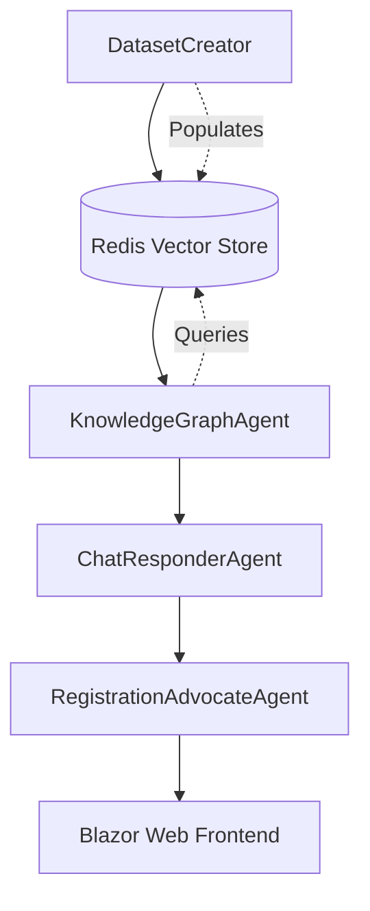

# DatasetCreator

A .NET 9 console application for importing and processing vehicle registration datasets into the Redis vector store used by the **KnowledgeGraphAgent** (Agent2Agent.AgentC) in the Agent2Agent proof-of-concept system.

## Purpose

The DatasetCreator serves as a data ingestion tool that:

- **Processes structured data** from CSV and PDF files containing vehicle registration information
- **Generates embeddings** using OpenAI's embedding models for semantic search capabilities
- **Populates Redis vector store** with searchable knowledge base content
- **Enables intelligent responses** from the KnowledgeGraphAgent about vehicle registration topics

## Architecture Context

This tool is part of the larger Agent2Agent ecosystem:



## Features

### Data Sources
- **CSV Files**: Structured vehicle registration data with configurable column mapping
- **PDF Documents**: Registration forms, manuals, and documentation with text extraction
- **Batch Processing**: Handle multiple files in a single operation
- **Data Validation**: Ensure data quality before embedding generation

### Processing Pipeline
1. **File Detection**: Automatically identify supported file formats
2. **Content Extraction**: Parse CSV rows or extract text from PDFs
3. **Text Chunking**: Split large documents into manageable chunks for embedding
4. **Embedding Generation**: Create vector representations using OpenAI models
5. **Vector Storage**: Store embeddings with metadata in Redis for fast retrieval

### Integration Features
- **Redis Compatibility**: Uses same Redis instance and schema as KnowledgeGraphAgent
- **Embedding Consistency**: Compatible with OpenAI embedding models used by Agent2Agent.AgentC
- **Metadata Preservation**: Maintains source file information and document structure

## Prerequisites

- **.NET 9 SDK** or later
- **Redis instance** running (default: `localhost:6379`)
- **OpenAI API key** with access to embedding models
- **Input data files** in supported formats (CSV/PDF)

## Configuration

Create an `appsettings.json` file in the DatasetCreator directory:

```json
{
  "Redis": {
    "ConnectionString": "localhost:6379"
  },
  "OpenAI": {
    "ApiKey": "<your-openai-api-key>",
    "EmbeddingModel": "text-embedding-3-small"
  },
  "Processing": {
    "ChunkSize": 1000,
    "ChunkOverlap": 200,
    "BatchSize": 50
  },
  "DataSources": {
    "InputDirectory": "./Data",
    "SupportedFormats": ["csv", "pdf"]
  }
}
```

## Usage

### Basic Usage

```bash
# Run from solution root
dotnet run --project DatasetCreator

# Or from DatasetCreator directory
cd DatasetCreator
dotnet run
```

### Command Line Options

```bash
# Process specific directory
dotnet run --project DatasetCreator -- --input "C:\VehicleData" --formats csv,pdf

# Specify pdf chunking options
dotnet run --project DatasetCreator -- --file "C:\VehicleData\forms.pdf" --state "CA" --chunk-size 500 --chunk-overlap 100

# Clear existing data before import
dotnet run --project DatasetCreator -- --clear-existing

# Verbose logging
dotnet run --project DatasetCreator -- --verbose
```

## Data Formats

### CSV Format Requirements

Expected CSV structure for vehicle registration data:

```csv
State,DocumentType,Title,Content,SourceUrl
CA,Registration Form,DMV Form 343,Vehicle registration application process...,https://dmv.ca.gov/forms
TX,Renewal Guide,Registration Renewal,Steps to renew your vehicle registration...,https://txdmv.gov/renewal
FL,Fee Schedule,Registration Fees,Current fee structure for vehicle registration...,https://flhsmv.gov/fees
```

**Required Columns:**
- `State`: US state abbreviation
- `DocumentType`: Type of document (Registration Form, Renewal Guide, Fee Schedule, etc.)
- `Title`: Document title or heading
- `Content`: Main text content to be embedded
- `SourceUrl`: Reference URL for the information

### PDF Processing

- **Text Extraction**: Automatically extracts text content from PDF documents
- **Metadata Preservation**: Maintains filename, creation date, and page numbers
- **Chunking Strategy**: Splits large documents while preserving context
- **Error Handling**: Skips corrupted or password-protected files with logging

## Output

### Redis Storage Schema

Data is stored in Redis with the following structure:

```
Key Pattern: doc:{unique-id}
Hash Fields:
  - text: The processed text content
  - embedding: Serialized float array of embedding vector
  - state: US state abbreviation
  - sourceUrl: Original document URL or file path (can be updated)
  - documentType: Type classification
  - title: Document title
  - chunkIndex: For multi-chunk documents
```

### Uniqueness & Update Logic

- Each record's uniqueness is determined by the combination of `state`, `documentType`, and `title`.
- If a new import matches these three fields, any changes to `content` or `sourceUrl` will overwrite the existing record and be logged for audit.
- This enables updating document details without creating duplicates.

### Processing Report

After completion, the tool generates a processing report:

```
=== DatasetCreator Processing Report ===
Files Processed: 145
  - CSV Files: 12 (1,250 records)
  - PDF Files: 133 (2,890 text chunks)
Redis Documents Created: 4,140
Processing Time: 00:03:42
Errors: 3 (see logs for details)
```

## Integration with KnowledgeGraphAgent

The processed data integrates seamlessly with Agent2Agent.AgentC:

1. **Vector Similarity Search**: KnowledgeGraphAgent queries Redis using embeddings
2. **Contextual Responses**: Retrieved chunks provide context for AI responses
3. **Source Attribution**: Metadata enables response citations and verification
4. **Real-time Updates**: New data can be added without system restart

## Development

### Project Structure

```
DatasetCreator/
  - Program.cs              # Main entry point
  - DatasetImporter.cs      # Handles file processing and embedding generation
  - appsettings.json        # Configuration file
  - README.md               # This file
  Services/
   - FileProcessor.cs    # File processing logic
   - EmbeddingService.cs # OpenAI embedding generation
   - RedisService.cs     # Redis vector storage
  Models/
   - DataModels.cs       # Data representations
   - Options.cs          # Configuration options
  Data/                    # Sample input files
   - sample_registrations.csv
   - sample_forms.pdf
```

### Building and Testing

```bash
# Restore dependencies
dotnet restore

# Build project
dotnet build

# Run with sample data
dotnet run -- --input "./Data" --verbose
```

## Troubleshooting

### Common Issues

**Redis Connection Failed**
```
Error: Could not connect to Redis at localhost:6379
Solution: Ensure Redis is running and accessible
```

**OpenAI API Errors**
```
Error: Invalid API key or quota exceeded
Solution: Verify OpenAI API key and account limits
```

**File Processing Errors**
```
Error: Unable to process PDF file
Solution: Ensure PDF is not password-protected or corrupted
```

### Logging

Enable verbose logging to troubleshoot issues:

```bash
dotnet run -- --verbose
```

Log files are written to: `./Logs/DatasetCreator-{timestamp}.log`

## Performance Considerations

- **Batch Processing**: Processes files in configurable batches to manage memory
- **Rate Limiting**: Respects OpenAI API rate limits for embedding generation
- **Memory Management**: Streams large files to avoid memory exhaustion
- **Redis Optimization**: Uses efficient Redis commands for bulk operations

## Sample Data

The project includes sample vehicle registration data in the `Data/` directory:

- `sample_registrations.csv`: Example CSV with vehicle registration information
- `sample_forms.pdf`: Example PDF documents with registration procedures
- `state_requirements.csv`: Sample data showing different state requirements

## Contributing

When contributing to DatasetCreator:

1. **Follow .NET 9 conventions** and use nullable reference types
2. **Add unit tests** for new processing features
3. **Update configuration schema** for new options
4. **Maintain compatibility** with KnowledgeGraphAgent expectations
5. **Document new data formats** or processing capabilities

## Related Documentation

- [Agent2Agent Architecture](../Docs/architecture.md)
- [KnowledgeGraphAgent Documentation](../Agent2Agent.AgentC/README.md)
- [OpenAI Embedding Models](https://platform.openai.com/docs/guides/embeddings)
- Redis Stack Documentation
  - [Connect to the Server](https://redis.io/docs/latest/develop/clients/dotnet/connect/)
  - [Index and query Vectors](https://redis.io/docs/latest/develop/clients/dotnet/vecsearch/)
  - [Vector search concepts](https://redis.io/docs/latest/develop/ai/search-and-query/vectors/)
---

**Note**: This tool is designed specifically for the Agent2Agent proof-of-concept and integrates with the existing Redis schema used by Agent2Agent.AgentC. For production use, consider adding additional data validation, error recovery, and monitoring capabilities.