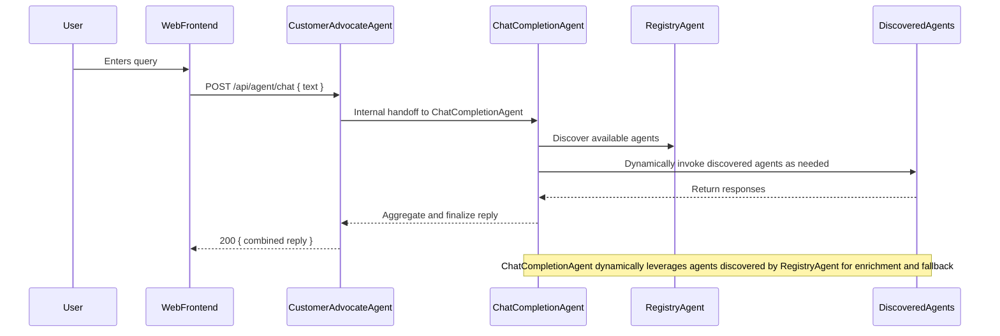

# Agent2Agent: Multi-Agent Roles and Endpoints

## Overview

This architecture features four agents, each with a distinct responsibility. They collaborate to answer user queries with fallback and enrichment logic.

---

## Agent Roles

### Agent A: CustomerAdvocateAgent (Semantic Agent)
- **Role:** Primary user-facing agent for vehicle registration advocacy and guidance.
- **Endpoint:** POST `/api/agent/chat`
- **Responsibilities:**
  - Hosts a Semantic Kernel `ChatCompletionAgent` named **CustomerAdvocateAgent**.
  - Aggregates and presents responses to users, ensuring clarity and accuracy.
  - Restricts replies strictly to vehicle registration and vehicles-related queries.

### Agent B: RegistryAgent (A2A Server)
- **Role:** Central registry and inter-agent communication hub.
- **Endpoint:** POST `/tasks`, GET `/.well-known/agent.json`
- **Responsibilities:**
  - Manages agent registration and discovery for the A2A protocol.
  - Hosts a Semantic Kernel `ChatCompletionAgent` named **VehicleRegistrationAssistant**.
  - Registers `RegistryAgentLogic` as `IAgentLogicInvoker` and `KnowledgeGraphAgentPlugin` for kernel functions.
  - Delegates queries to KnowledgeGraphAgent (AgentC) for factual enrichment and InternetSearchAgent (AgentD) for fallback.
  - Aggregates and refines responses for upstream agents.

### Agent C: KnowledgeGraphAgent (A2A Server)
- **Role:** Semantic knowledge base and vector search provider.
- **Endpoint:** POST `/tasks`, GET `/.well-known/agent.json`
- **Responsibilities:**
  - Hosts a Semantic Kernel `ChatCompletionAgent` named **KnowledgeGraphAgent** with the `search_knowledgebase` function.
  - Registers `KnowledgeGraphAgentLogic` as `IAgentLogicInvoker` and `FactStorePlugin` in DI.
  - Manages a Redis-based vector store for embedding management, semantic search, and factual grounding.
  - Provides factual, context-rich responses to agent queries using semantic search.

### Agent D: InternetSearchAgent (A2A Server)
- **Role:** External information and fallback search agent.
- **Endpoint:** POST `/tasks`, GET `/.well-known/agent.json`
- **Responsibilities:**
  - Hosts a Semantic Kernel `ChatCompletionAgent` named **InternetSearchAgent** with the `search_internet` function.
  - Registers `InternetSearchAgentLogic` as `IAgentLogicInvoker` and `SearchPlugin` for kernel functions.
  - Uses Redis caching for search results and connects to external search APIs for live data.
  - Provides fallback and enrichment responses when knowledge graph data is insufficient.

---

## Sequence Overview

The current flow is as follows:

This architecture allows the CustomerAdvocateAgent's internal ChatCompletionAgent to dynamically discover and invoke any available agents registered with the RegistryAgent, rather than relying on hardcoded agent calls.

---

## Implementation Notes

- All agents are ASP.NET Minimal API projects.
- Agent D uses **StackExchange.Redis** for distributed caching.
- Each agent calls `builder.AddServiceDefaults()` for consistent middleware.
- The orchestrator (AppHost) manages agent registration, service references, and health checks via `AppHost.cs`.
- **DatasetCreator** is responsible for ingesting, chunking, and embedding vehicle registration data from CSV/PDF sources, and storing it in Redis for use by KnowledgeGraphAgent (AgentC). This enables semantic search and factual grounding for all agent responses.
- The Redis schema includes fields for text, embedding, state, sourceUrl, documentType, title, and chunkIndex, ensuring compatibility between DatasetCreator and KnowledgeGraphAgent.
