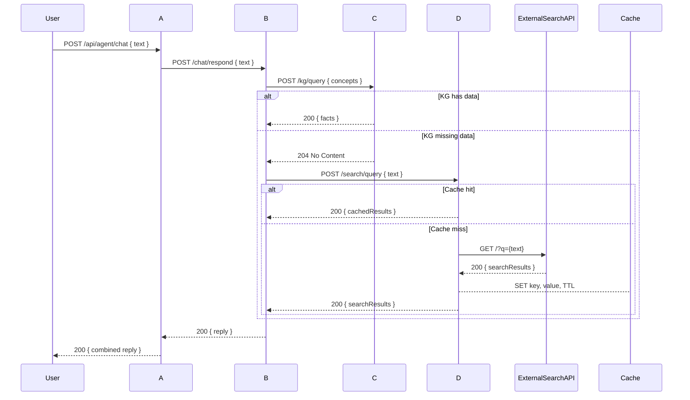

# Agent2Agent: Multi-Agent Roles and Endpoints

## Overview

This architecture features four agents, each with a distinct responsibility. They collaborate to answer user queries with fallback and enrichment logic.

---

## Agent Roles

### Agent A: RegistrationAdvocateAgent (Semantic Agent)
- Endpoint: POST `/api/agent/chat`
- Hosts a Semantic Kernel `ChatCompletionAgent` named **RegistrationAdvocate**.
- Registers `ChatResponderAgentPlugin` and `InternetSearchAgentPlugin` for inter-agent calls.
- Invokes AgentB (ChatResponderAgent) and AgentD (InternetSearchAgent) via A2AClient to enrich responses on vehicle registration topics.
- Restricts replies strictly to vehicle registration and vehicles-related queries.

### Agent B: ChatResponderAgent (A2A Server)
- Configured via `builder.Services.AddA2AServer` with AgentCard settings and `builder.Services.AddA2AClient` pointing at KnowledgeGraphAgent.
- Registers `ChatResponderAgentLogic` as `IAgentLogicInvoker` and `KnowledgeGraphAgentPlugin` for kernel functions.
- Hosts a Semantic Kernel `ChatCompletionAgent` named **VehicleRegistrationAssistant**.
- Maps A2A endpoints using `app.MapA2AWellKnown()` and `app.MapA2AEndpoint()`.
- Uses A2AClient to invoke KnowledgeGraphAgent for factual data enrichment.

### Agent C: KnowledgeGraphAgent
- Endpoint: POST `/kg/query`
- Maintains an in-memory or persisted knowledge graph of domain facts.
- Returns 200 OK with matching facts or 204 No Content if no relevant data is found.

### Agent D: InternetSearchAgent
- Endpoint: POST `/search/query`
- Uses Redis (`StackExchange.Redis`) for caching search results.
- On cache miss, calls an external search API (e.g., Bing Web Search).
- Caches results with a TTL and returns them for fallback enrichment.

---

## Sequence Overview

---

## Implementation Notes

- All agents are ASP.NET Minimal API projects.
- Agent D uses **StackExchange.Redis** for distributed caching.
- Each agent calls `builder.AddServiceDefaults()` for consistent middleware.
- The orchestrator (Agent A) manages agent registration, service references, and health checks via `AppHost.cs`.
