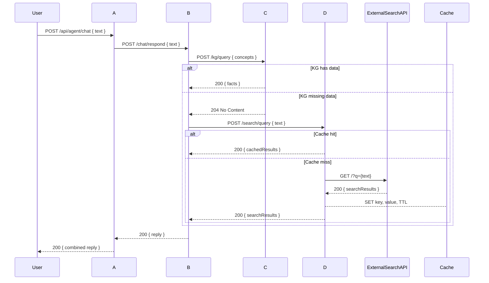

# Agent2Agent: Multi-Agent Roles and Endpoints

## Overview

This architecture features four agents, each with a distinct responsibility. They collaborate to answer user queries with fallback and enrichment logic.

---

## Agent Roles

### Agent A: RegistrationAdvocateAgent (Semantic Agent)
- Endpoint: POST `/api/agent/chat`
- Hosts a Semantic Kernel `ChatCompletionAgent` named **RegistrationAdvocate**.
- Registers `ChatResponderAgentPlugin` and `InternetSearchAgentPlugin` for inter-agent calls.
- Invokes AgentB (ChatResponderAgent) and AgentD (InternetSearchAgent) via A2AClient to enrich responses on vehicle registration topics.
- Restricts replies strictly to vehicle registration and vehicles-related queries.

### Agent B: ChatResponderAgent (A2A Server)
- Configured via `builder.Services.AddA2AServer` with AgentCard settings and `builder.Services.AddA2AClient` pointing at KnowledgeGraphAgent.
- Registers `ChatResponderAgentLogic` as `IAgentLogicInvoker` and `KnowledgeGraphAgentPlugin` for kernel functions.
- Hosts a Semantic Kernel `ChatCompletionAgent` named **VehicleRegistrationAssistant**.
- Maps A2A endpoints using `app.MapA2AWellKnown()` and `app.MapA2AEndpoint()`.
- Uses A2AClient to invoke KnowledgeGraphAgent for factual data enrichment.

### Agent C: KnowledgeGraphAgent (A2A Server)
- Configured via `builder.AddServiceDefaults()` and `builder.Services.AddDependencies()`.
- Registers `KnowledgeGraphAgentLogic` as `IAgentLogicInvoker` and `FactStorePlugin` in DI.
- Hosts a Semantic Kernel `ChatCompletionAgent` named **KnowledgeGraphAgent** with the `search_knowledgebase` function.
- Maps A2A discovery and invocation endpoints via `app.MapA2AWellKnown()` and `app.MapA2AEndpoint()`.
- Uses Redis-based `RedisVectorStoreProvider` for embedding management and persistence.

### Agent D: InternetSearchAgent (A2A Server)
- Configured via `builder.Services.AddAgentDependencies()` and `AddA2AServer` with AgentCard settings.
- Registers `InternetSearchAgentLogic` as `IAgentLogicInvoker` and `SearchPlugin` for kernel functions.
- Hosts a Semantic Kernel `ChatCompletionAgent` named **InternetSearchAgent** with the `search_internet` function.
- Maps A2A endpoints using `app.MapA2AWellKnown()` and `app.MapA2AEndpoint()`.
- Future enhancements:
  - Integrate Redis caching for search results
  - Connect to external search APIs for live data

---

## Sequence Overview

---

## Implementation Notes

- All agents are ASP.NET Minimal API projects.
- Agent D uses **StackExchange.Redis** for distributed caching.
- Each agent calls `builder.AddServiceDefaults()` for consistent middleware.
- The orchestrator (Agent A) manages agent registration, service references, and health checks via `AppHost.cs`.
