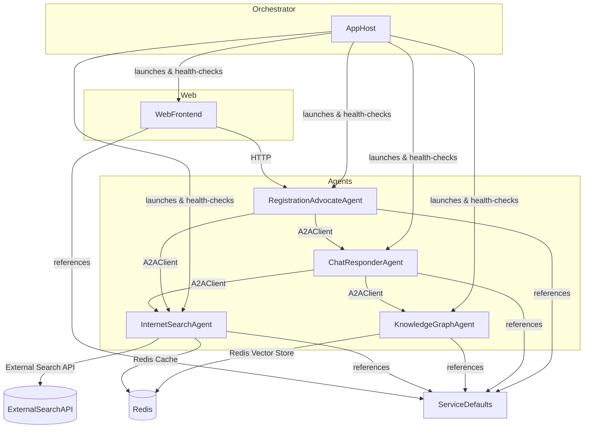
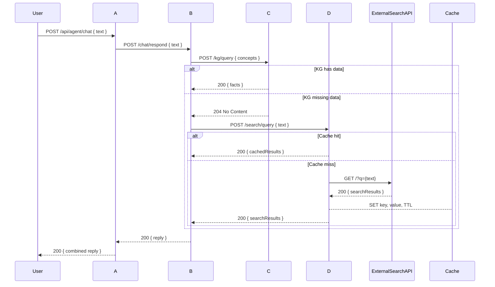

# Agent2Agent Architecture Overview

This document provides a high-level overview of the Agent2Agent proof-of-concept, outlining its structure, component responsibilities, and runtime relationships.

---

## Project Structure

- **Agent2Agent.Web (WebFrontend)**  
  The Blazor Server web interface where users interact with agents.  
  - Uses Razor Components and Output Cache.  
  - Communicates with orchestrator and agents via HTTP.

- **Agent2Agent.AppHost (Orchestrator)**
  The orchestrator launches and monitors the WebFrontend and RegistrationAdvocateAgent, as well as other agents.
  - Runs and monitors all agents and services, performing health checks.
  - Configures and serves as the entry point for the distributed application.

- **Agent2Agent.AgentA (RegistrationAdvocateAgent)**  
  A Semantic Kernel–driven agent exposing `/api/agent/chat`.  
  - Hosts a `ChatCompletionAgent` named "RegistrationAdvocate".  
  - Registers `ChatResponderAgentPlugin` and `InternetSearchAgentPlugin`.  
  - Invokes AgentB and AgentD via A2AClient to enrich responses on vehicle registration topics.  
  - Restricts replies to vehicle registration and related queries.

- **Agent2Agent.AgentB (ChatResponderAgent)**  
  The A2A server hosting vehicle registration assistant logic.  
  - Configured via `builder.Services.AddA2AServer` with AgentCard settings and `builder.Services.AddA2AClient` for KnowledgeGraphAgent.  
  - Registers `ChatResponderAgentLogic` as `IAgentLogicInvoker` and `KnowledgeGraphAgentPlugin` in DI.  
  - Hosts a Semantic Kernel `ChatCompletionAgent` named **VehicleRegistrationAssistant**.  
  - Maps A2A endpoints using `app.MapA2AWellKnown()` and `app.MapA2AEndpoint()`.  
  - Uses A2A client to invoke KnowledgeGraphAgent for factual enrichment.

- **Agent2Agent.AgentC (KnowledgeGraphAgent)**
  The A2A server hosting knowledge graph functionality.
  - Configured via `builder.AddServiceDefaults()` and `builder.Services.AddDependencies()`.
  - Registers `KnowledgeGraphAgentLogic` as `IAgentLogicInvoker`, `FactStorePlugin`, and embedding/vector store providers.
  - Hosts a `ChatCompletionAgent` named **KnowledgeGraphAgent** with `search_knowledgebase` function.
  - Maps A2A endpoints using `app.MapA2AWellKnown()` and `app.MapA2AEndpoint()`.
  - Persists embeddings in Redis and ensures vector store index on startup.

- **Agent2Agent.AgentD (InternetSearchAgent)**
  The A2A server hosting internet search functionality.
  - Configured via `builder.Services.AddAgentDependencies()` and `AddA2AServer` with AgentCard settings.
  - Registers `InternetSearchAgentLogic` as `IAgentLogicInvoker` and `SearchPlugin` for kernel functions.
  - Hosts a `ChatCompletionAgent` named **InternetSearchAgent** with `search_internet` function.
  - Maps A2A endpoints using `app.MapA2AWellKnown()` and `app.MapA2AEndpoint()`.
  - Planned enhancements:
    - Integrate Redis caching for search results.
    - Connect to external search APIs for live data.

- **Agent2Agent.ServiceDefaults**  
  Shared library for common bootstrapping routines.  
  - Provides extensions for OpenAPI, exception handling, caching, and default endpoint mapping.

---

## Component Diagram

---

## Sequence Diagram

---

## Startup Sequence
- **AppHost** ([AppHost.cs](Agent2Agent.AppHost/AppHost.cs:1))
  1. Creates the distributed application builder.
  2. Adds WebFrontend and RegistrationAdvocateAgent with health checks.
  3. Builds and runs all components.

- **RegistrationAdvocateAgent** ([Program.cs](Agent2Agent.AgentA/Program.cs:1))  
  1. Configures OpenAI chat client and Semantic Kernel plugins.  
  2. Registers ChatResponderAgentPlugin and InternetSearchAgentPlugin.  
  3. Maps OpenAPI and default endpoints.  
  4. Runs the agent host.

---

## Shared Library Patternse and intgrations

All services and agents reference `ServiceDefaults` to apply consistent middleware and integrations:

- **OpenAPI**: Automated API endpoint generation.  
- **Exception Handling**: ProblemDetails and global error handlers.  
- **Caching**: Redis caching for AgentD; output caching for WebFrontend.  
- **Default Endpoints**: Uniform endpoint mapping across services.

- [Microsoft Semantic Kernel Agents](https://learn.microsoft.com/en-us/semantic-kernel/frameworks/agent/?pivots=programming-language-csharp)  
- [A2A Project Documentation](https://a2aproject.github.io/A2A/v0.2.5/)  